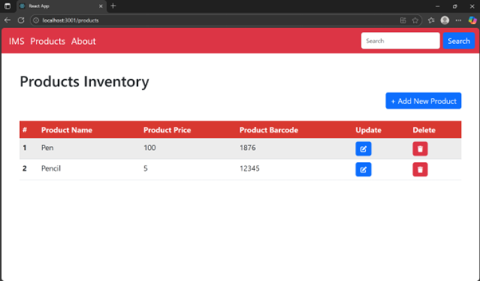
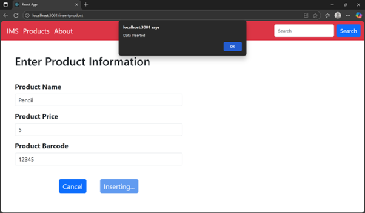
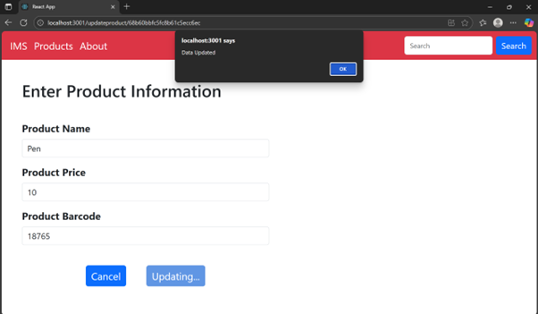

# Product-Inventory-System – MERN Stack

A full-stack Inventory Management System built using the MERN stack (MongoDB, Express.js, React.js, Node.js) that enables users to perform full CRUD operations on products, including adding, viewing, updating, and deleting items.

## Features

- Add new products with validation
- View a list of all products
- Update product details
- Delete products from the inventory
- RESTful API integration between frontend and backend
- MongoDB database for data persistence

## Tech Stack

- **Frontend:** React.js, React Router, Bootstrap
- **Backend:** Node.js, Express.js
- **Database:** MongoDB (local or Atlas)
- **Tools:** npm, VS Code, MongoDB Compass/Postman


## Demo

### Home Page


### Products List


### Insert Product Form


### Update Product Form



## Getting Started

### Prerequisites

- Node.js installed
- MongoDB running locally or an active MongoDB Atlas cluster

### Backend Setup

- ```bash
- cd Backend
- npm install


### Start the Backend Server

npm start


### Frontend Setup

cd Frontend
npm install
npm start

###Frontend will run at http://localhost:3000
###Backend will run at http://localhost:3001


### API Endpoints

| Method | Endpoint             | Description         |
| ------ | -------------------- | ------------------- |
| GET    | `/products`          | Fetch all products  |
| GET    | `/products/:id`      | Fetch product by ID |
| POST   | `/insertproduct`     | Add a new product   |
| PUT    | `/updateproduct/:id` | Update product      |
| DELETE | `/deleteproduct/:id` | Delete product      |


## 💡 Why This Project

This Inventory Management System was developed as a practical full-stack application to demonstrate proficiency in the MERN stack. It focuses on real-world functionality such as CRUD operations, database integration, and clean UI design using React and Bootstrap.

The goal is to provide a foundational system that can be extended for business use or further development.


### License

This project is licensed under the MIT License — see the LICENSE file for details.

### Contact

Created by **Aditya Kumar** — feel free to reach out!
## LinkedIn:- **www.linkedin.com/in/aditya-kumar-04398424a**
## Email:- **Adityakumar17711@gmail.com**
